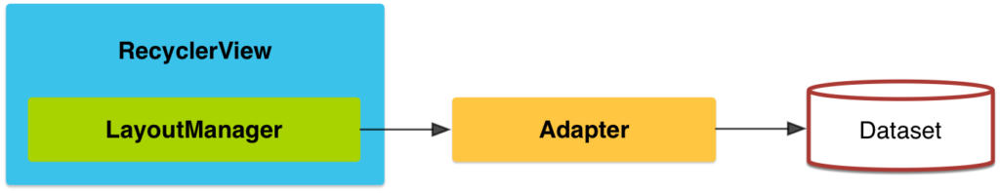

# Recycer View

ReciclerView sería la evolución de las listas en android.

RecyclerView facilita que se muestren de manera eficiente grandes conjuntos de datos. 
Tú proporcionas los datos y defines el aspecto de cada elemento, y la biblioteca
RecyclerView creará los elementos de forma dinámica cuando se los necesite.

La clase RecyclerView nos permite mostrar un listado (o bien una grilla) de elementos.
Lleva este nombre porque a medida que se renderizan los elementos de la lista, los elementos que dejan de observarse se reciclan para mostrar los elementos siguientes.
RecyclerView es una versión mejorada de la clase ListView, principalmente cuando el número de elementos es variable, y/o los datos cambian continuamente.
Es posible personalizar un ListView para lograr lo mismo, pero implicaría considerar varios detalles, a fin de conseguir el mismo rendimiento.

## CardView

Si bien un RecyclerView representa una lista de elementos, cada elemento debe tener una UI definida.
Al usar Material Design se suele usar la clase CardView para definir la apariencia de cada elemento de un listado, en la mayoría de los casos.

No es obligatorio que se usen en conjunto, pero es usual hacerlo.

## Diagrama 

Si comprendemos estos conceptos, lo hemos comprendido todo sobre RecyclerViews.

Veamos uno por uno:

1. RecyclerView: Nuestro RecyclerView se va a "pintar" en función al LayoutManager que reciba como parámetro. También hará uso de un Adapter, que funcionará de acuerdo a un Dataset.
2. LayoutManager: Este "gestor del diseño" va a definir la disposición de los elementos. Es decir, si van formando una lista vertical u horizontal, si van formando una cuadrícula, u otra variante.
3. Adapter: El adaptador se encargará de adaptar el dataset a lo que finalmente verá el usuario. Es el encargado de traducir datos en UI.
4. Dataset: Es el conjunto de datos que se espera mostrar en el RecyclerView. Se puede representar por un simple array de objetos String; o ser algo más elaborado, como un ArrayList de objetos que presentan múltiples atributos.

## ¿Cómo definir un adapter?

Un adapter:

1. contiene una clase interna ViewHolder, que permite obtener referencias de los componentes visuales (views) de cada elemento de la lista,
2. presenta un constructor y/o métodos para gestionar el Data Set (añadir, editar o eliminar elementos),
3. contiene un método onCreateViewHolder que infla el layout (archivo xml) que representa a nuestros elementos, y devuelve una instancia de la clase ViewHolder que antes definimos;
4. contiene un método onBindViewHolder que enlaza nuestra data con cada ViewHolder, y
5. contiene un método getItemCount que devuelve un entero indicando la cantidad de elementos a mostrar en el RecyclerView.

## Bibliografía

https://developer.android.com/guide/topics/ui/layout/recyclerview?hl=es-419